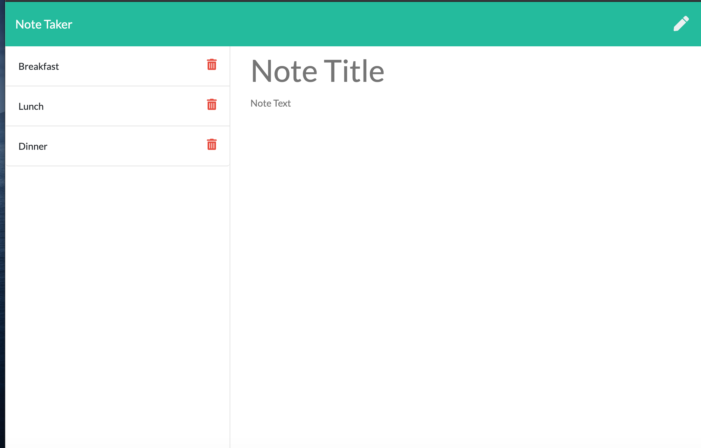

  # Note Taker

   
  ## License
  
  <a href="https://opensource.org/licenses/MIT"></img></a>

  ## Description

  This is an app that utilizes both front end and back end development. When a note is created it is saved on a server.

  ## Images

To launch front end: <a href="https://bh007183.github.io/note/">Front End</a>
  
  ## Table of Content

  * [Installation](#installation)

  * [Usage](#usage)

  * [License](#license)

  * [Contributing](#contributors)

  * [Contact](#questions/contact)

  ## Installation

  To Install necessary dependencies, run the following command:
  
  npm i

  ## Usage

      To create a note, click in the title section and then enter your notes title. After that, enter in your note. Once done, click on the save icon in the top right corner. To delete the note, click on the trash can icon.

    
  
  ## Technologies

      Express, Jquery, Node, and FS.

  ## Contributors

  UW coding bootcamp and Ben Hopkins

  ## Questions/Contact

  <a href="https://github.com/bh007183">GitHub Profile</a>
  <a href="mailto:bjhops17@gmail.com"> Email Me</a>
  
  

  